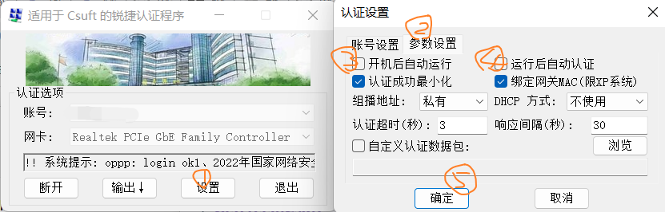

# GetFreeInCsuft

## :star: 前言

GetFreeInCsuft 项目致力于使广大 Csufter 能够较为舒服的使用校园网，当然既然起了这个名字，应该不限于校园网，任何能够白嫖的事情应该都可以。

笔者家贫，无从致网以用，每假借于有网之人，手脚并用，计分以还...... 咳咳，总之后来发现了 mentohust 这个项目，于是使用了 Openwrt + mentohust 在宿舍内用了两年路由器，后来想要在 windows 上使用，于是有了该项目，也算是对自己大学期间折腾网络的总结吧。

锐捷客户端更恶心的一个地方就是，对于计算机专业同学来说，开启虚拟机会造成多 IP 导致掉线，十分恶心，并且不能电脑开热点。

## :bookmark_tabs:项目说明

由于该 Mentohust 项目十分久远，源码已经找不到了，找到了一个魔改版本：[zzurj](https://github.com/2512500960/zzurj)，总之基于 802.1x 的认证包结构大致都差不多，所以基本上就是针对这个项目进行了部分魔改，更改了部分字段的偏移量，总之目前暂时能用了，隐藏 Bug 应该不会少，有问题请提 Issues 或 [QQ群：389616405](https://qm.qq.com/cgi-bin/qm/qr?k=Fn2dZQUkubDl_rA8E-Yv8kcut5fzGML2&jump_from=webapi&authKey=1Om2MmWG3CbOakrQf257j1eCX+WpRbQAYABGYfE3SB19bzlzc0S5hRpZCKcnJVrR)

## :pencil2: 项目使用

For Windows:

- 请直接在 Release 中下载最新版本

For Linux:

- Linux 可以使用 [minieap](https://github.com/updateing/minieap)，使用 Linux 作为主系统，相信你的能力是可以的，加油！

For Mac：

- I can't do it，似乎是有相关的项目的

### Windows

> 注意，需要接口正常的，使用该程序才能认证成功，该程序认证成功后可以正常开启热点功能等，对计算机专业同学来说，需要开启虚拟机，作用更大！（不用我多说了吧，多 IP 烦死人）

1. 下载好最新版本的应用程序，并设置以管理员方式运行。

   ① 右键 **认证助手.exe**，② 点击 **兼容性**，③ 选择 **以管理员身份运行此程序**，④ 点击 **应用**

2. 若打开助手提示找不到 `mfc140ud.dll`、`VCRUNTIME.dll`、`ucrtbased.dll`、`wpcap.dll` 等文件，则是缺少微软运行库，一般表现在新安装的纯净系统上（缺少很多运行库，需要手动安装），若遇到此提示，请确认操作系统位数，然将项目中的 `back/dll/` 的文件

   - 32 位操作系统：将 `win32` 文件夹下所有文件移动至 `C:\\Windows\\System32` 文件夹内
   - 64 位操作系统：将 `win64` 文件夹下所有文件移动至 `C:\\Windows\\SysWOW64` 文件夹内

   或 **以管理员方式运行** **安装&卸载.bat** 批处理脚本即可。

3. 若打开助手提示找不到网卡，或网卡列表为空，请退出程序，并双击 **WinPcap_4_1_3.exe**，安装此程序，全部默认安装。

4. 双击打开认证助手，并设置账号密码

   

5. 选择网卡

   **默认选择的网卡一定不是有线网卡！！！**

   网卡列表中包含以下字符的一定不是有线网卡，具体自己有线网卡是哪个请自行确定：

   - `Microsoft`
   - `Wireless`
   - `AX`
   - `AC`
   - `Adapter`
   - `Hyper-V`
   - `Virtual`
   - `Wan`

6. 点击认证上网即可，有时会发包失败，再试一次即可， 一般认证上之后就不会掉线了

7. 设置开启自动启动以及自动认证

   

8. 若开启电脑热点提示无法开启，请尝试重启电脑即可。

## 其他

### 交叉编译 mentohust 及 Openwrt

待补充

### 网页认证

## 版本说明

### V1.1

- 第一次编译，仅针对电信认证进行抓包更改字段偏移量，未对移动、联通账号进行测试，不过按照推算应该是都一样的。

